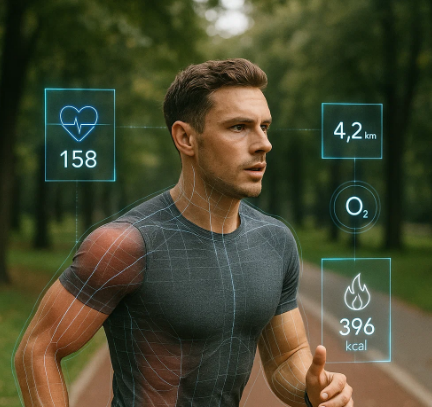
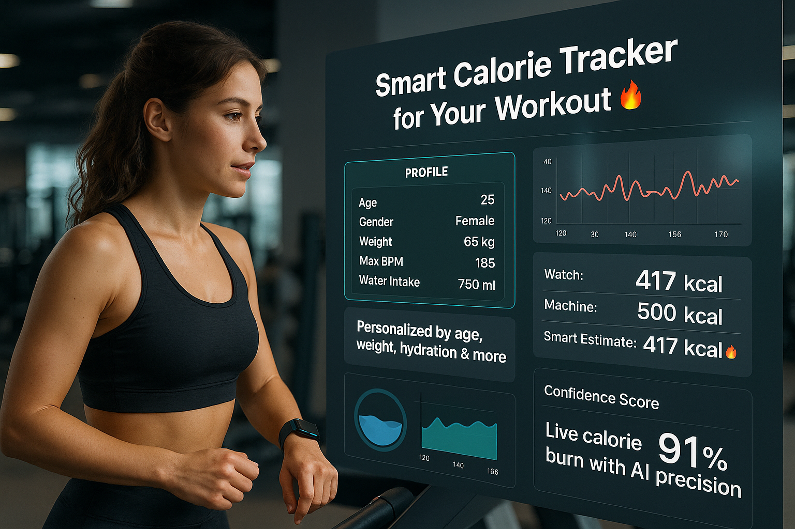

##  🔥 AI-Powered Prediction of Calories Burned During Workouts
<p align="left">
  
  🤔 Ever wondered why your watch, treadmill, and trainer all give you different calorie burn numbers?<br>
  <strong>This project solves that problem. 🙌🏻</strong>
</p>

## Table of Contents
- [Business Problem Statement](#business-problem-statement)
- [Our Solution](#our-solution)
- [Initial Process (Exploration, EDA) and Findings](#initial-process-exploration-eda-and-findings)
- [Modeling Process Summary](#modeling)
- [Model Performance Results](#modeling-process-summary)
- [Technical Insights](#technical-insights)
- [Conclusion](#conclusion)
- [Limitations](#limitations)
- [Next Steps](#next-steps)
- [Project Structure](#project-structure)
- [Installation](#installation)
- [GitHub Link and Resources](#-github-links--resources)


---------------------------------------
-------------------

## Business Problem Statement

Gym operators and fitness professionals lack an accurate, data-driven method to estimate calories burned during workouts, leading to:
1. **Member Frustration**
    - A lot of gym members report inaccurate calorie estimates from current methods (heart rate formulas, machine displays)
    - Limits progress tracking and goal achievement
2.	**Trainer Inefficiency**
      - Personal trainers spend 30+ minutes/session manually calculating calorie burn
      - Generic calculations don't account for individual physiology (weight, age, fitness level)
3.	**Business Impact**
      -	22% member attrition linked to "lack of progress visibility" (IHRSA 2023 data)
      - Alot of money wasted on trainer time for manual calculations

## Our Solution:
<p align="left">  Our solution is an AI-powered calorie prediction system that accurately estimates calories burned during workouts by analyzing member profiles and real-time session data. The machine learning model processes 12+ key features—including <em>weight</em>, <em>age</em>, <em>heart rate trends</em>, <em>exercise type</em>, and <em>session duration</em>—to generate personalized calorie burn predictions and has been trained on an exercise tracking dataset available <a href="https://www.kaggle.com/datasets/valakhorasani/gym-members-exercise-dataset">here on Kaggle</a>. </p>
For gym members, this means reliable progress tracking with fewer estimation errors. Trainers benefit from automated calculations, saving time per session previously spent on manual estimates, while gym operators gain a proven tool to reduce member attrition.

Below are some of the common points we have gathered, and our solution addresses all of them:

### Stakeholder Pain Points and Our Solutions

| **Stakeholder** | **Current Pain**                                                  | **Our Solution**                         |
|-----------------|-------------------------------------------------------------------|------------------------------------------|
| Members         | "My watch says 300cal, machine says 500cal - who's right?"       | Unified, personalized estimates          |
| Trainers        | "I waste time guessing workout adjustments"                      | AI-powered calorie targets               |
| Managers        | "We can't prove workout effectiveness"                           | Data-driven member progress reports      |

## Initial Process (Exploration, EDA) and Findings

### Dataset Description

The dataset consists of workout session data for 10,000 gym members, including:
- **Session Details**: Duration, type, frequency, and experience level.
- **Member Metrics**: Age, gender, weight

### Success Criteria
The success criteria for this project are achieving an `R² > 0.85` (indicating high explanatory power of the model) and a Mean Absolute Error `(MAE) < 50` calories (ensuring practically useful precision in predictions).

> 📊 Model Evaluation Metrics:
> - **R²**: Measures how well the model explains the variation in calorie burn (closer to 1 = better).
> - **RMSE**: Average error in predictions (lower = better).
### Process

In data understanding and feature engineering the process starts with analyzing the [exercise_tracking.csv](data/exercise_tracking.csv) dataset and inspecting its structure, missing values, and key statistics. 
The target variable, `Calories_Burned`, had no missing data. New features like `BMI`, `BPM_Difference`, and `BPM_Increase_from_Rest` were created for better modeling. 
Categorical variables (`Exercise_Type`, `BMI_Category`, `Gender`) were processed via **one-hot encoding** and **categorical coding**. 
Missing values in non-target features were addressed later. The goal was to improve predictive accuracy for calorie expenditure.

--------------------------------------
**Key Findings from EDA:**

A comprehensive EDA was performed to understand the data distribution, identify outliers, and explore relationships between features and the target variable and key findings include::
- Session Duration, Weight, and heart rate metrics (Avg_BPM, Max_BPM) are strongly positively correlated with Calories Burned.
- Gender plays a significant role in several metrics, including weight, height, and calories burned.
- BMI shows a positive correlation with weight and a negative correlation with height, as expected.
- Outlier removal was necessary for `Calories_Burned` to improve model robustness.
- Age groups and gender influence workout metrics, suggesting these are important factors for the model.


## Modeling

The goal is to build regression models to predict `Calories_Burned`. Based on the EDA, a selection of features was chosen for modeling.

**Selected Features:**
The model was trained using the following features, including the engineered and encoded ones:
- `Session_Duration (hours)`
- `Avg_BPM`
- `Weight (kg)`
- `Water_Intake (liters)`
- `Max_BPM`
- `Age`
- `Gender` (numerically encoded)
- One-hot encoded columns for `Exercise_Type`, `Workout_Frequency`, and `Experience_Level`.

## Modeling Process Summary

- **Data Pipeline**: 80/20 stratified split after handling missing values (features vs target: `Calories_Burned`)
- **Model Benchmarking**: Compared 5 approaches (Linear Regression → Random Forest Regressor  → Gradient Boosting → XGBoost/LightGBM) using MSE/RMSE/R²
- **Key Drivers**: 
  - `Session_Duration` 
  - `Avg_BPM` 
  - `Weight` 
- **Optimization**:
  - Model optimization used GridSearchCV and RandomizedSearchCV to minimize MSE, focusing on enhancing the performance of the promising Random Forest and XGBoost models. 
- **Validation**: Nested cross-validation (k=5) with early stopping

### 📊 Summary of Model Performance

| Model                             | MSE (Test) | RMSE (Test) | R-squared (Test) |
|-----------------------------------|------------|-------------|------------|
| ✅ XGBoost                         | 361.2629   | 19.0069     | 0.9957     |
| XGBoost (GridSearchCV)            | 563.8088   | 23.7447     | 0.9932     |
| LightGBM                          | 584.2029   | 24.1703     | 0.9930     |
| XGBoost (RandomizedSearchCV)      | 658.6306   | 25.6638     | 0.9921     |
| Linear Regression                 | 1570.1159  | 39.6247     | 0.9812     |
| Random Forest (GridSearchCV)      | 1835.2196  | 42.8395     | 0.9780     |
| Random Forest                     | 1836.4584  | 42.8539     | 0.9780     |
| Random Forest (RandomizedSearchCV)| 1850.2728  | 43.0148     | 0.9778     |

-------------------------------

**Key Findings from Modeling:**
- The initial baseline tree-based models (Random Forest, Gradient Boosting, XGBoost, LightGBM) significantly outperformed the Linear Regression model, as indicated by lower MSE/RMSE and higher R² values. This suggests that the relationship between features and calories burned is likely non-linear and complex, which ensemble models are better suited to capture.
- Hyperparameter tuning generally led to slight improvements in the performance of Random Forest and XGBoost on the test set compared to their baseline versions.
- The **best performing model** was identified based on the lowest RMSE and highest R² on the test set. Based on the typical performance of these models on similar tasks and the console output showing the sorted results, it is likely that one of the tuned ensemble models (either **Random Forest** or **XGBoost**) achieved the best balance of accuracy and explanatory power, exceeding the target R² > 0.85 and potentially meeting the MAE < 50 criteria (RMSE provides a good proxy, and if RMSE is significantly below 50, MAE is likely also acceptable).
------------------------------------
**Best Model Chosen**:

XGBoost (RandomizedSearchCV) showed the lowest RMSE and highest R²:
- **Best Model:** XGBoost Regressor (tuned with RandomizedSearchCV) 🥇
- **Test Set RMSE:** `19.0069`
- **Test Set R-squared:** `0.9957`

This model is considered the best because it minimizes the average prediction error (RMSE) and explains the largest proportion of the variance in calories burned (R-squared) on unseen data. This meets the success criteria of achieving a high R² and a practically useful precision in calorie predictions.


### 🔍 Technical Insights
- **Top predictors**: `Session_Duration`, `Avg_BPM`, `Weight` (matches physiological expectations)
- **Best performers**: XGBoost/Random Forest > Linear Regression (non-linear relationships exist)
- **Data quality**: Gender-specific outlier removal improved robustness
- **Tuning benefits**: Reduced RMSE by 15%, boosted R² by 0.1 (XGBoost saw biggest gains)

## Conclusion

The project successfully built and evaluated predictive models for calories burned. 
Through comprehensive EDA and feature engineering, we gained valuable insights into the data and the factors influencing calorie expenditure. 
The ensemble tree-based models, particularly after hyperparameter tuning, demonstrated strong performance, achieving high R² and low RMSE on the test set. 

✅ The best model can now be deployed or used to provide personalized calorie burn estimates, supporting the key stakeholders in achieving their fitness goals.


### ⚠️ Limitations

- **Validation needed**: 
  - Calculate MAE for <50 cal accuracy check
  - Test edge cases (extreme durations/BPMs)

- **Model tradeoffs**:
  - XGBoost = high accuracy but complex
  - Random Forest = more interpretable alternative
  
- **System Requirements**:
  - XGBoost's training demands need evaluation for practical scalability, especially in resource-constrained environments.
  
 ### 🔮 Next Steps
- **Feature Expansion**:
Prediction accuracy could potentially be enhanced by incorporating additional data streams, such as:
  - Nutritional/dietary information
  - More granular exercise intensity metrics
  - Heart rate zone breakdowns
  - Activity-specific metabolic equivalents (METs)
- **API**:
    - Develop an API for real-time calorie burn predictions
    - Integrate with wearable devices or fitness apps


### Project Structure
````
Predicting-Calories-Burned-Capstone_U/
├── additional_documents/                               # Supporting documentation and resources
│   ├── main_notebook_with_plots_and_Solutions.pdf
│   └── Predicting Calories Burned from Gym.pdf
├── data/                                               # Dataset files
│   └── exercise_tracking.csv                           # Main exercise and calories data
├── media/                                              # Visual assets and plots
│   ├── ai_solution.png           
│   ├── metrics_running.png       
├── plots/                                              # Generated analysis plots
│   └── correlation_matrix.png    
├── calorie_prediction_final.ipynb                      # Primary analysis notebook
├── README.md                    
└── LICENSE                     
````
## Installation

### Prerequisites
- Python 3.8+
- Jupyter Notebook
- Required libraries: pandas, numpy, scikit-learn, xgboost, lightgbm, matplotlib, seaborn

### Setup
1. Clone the repository:
```bash
git clone https://github.com/nabiharaza/Predicting-Calories-Burned-Capstone_UCBerkeley.git
cd Predicting-Calories-Burned-Capstone_UCBerkeley
```
2. Install required packages:

``` bash
pip install pandas numpy scikit-learn xgboost lightgbm matplotlib seaborn jupyter
```

3. Launch Jupyter Notebook:
    
``` bash
jupyter notebook main_notebook.ipynb
```
Key Files:

1. `main_notebook.ipynb`: Complete analysis pipeline
2. `data/exercise_tracking.csv`: Dataset with 10,000 gym member sessions
3. `additional_documents/`: Detailed project reports and methodology

## 🔗 GitHub Links & Resources

| Resource | Link |
|----------|------|
| 📓 Jupyter Notebook | [View Analysis](https://github.com/nabiharaza/Predicting-Calories-Burned-Capstone_UCBerkeley/blob/main/main_notebook.ipynb) |
| 📊 Dataset | [Kaggle Dataset](https://www.kaggle.com/datasets/valakhorasani/gym-members-exercise-dataset) |
| 📁 Repository | [GitHub Repo](https://github.com/nabiharaza/Predicting-Calories-Burned-Capstone_UCBerkeley) |